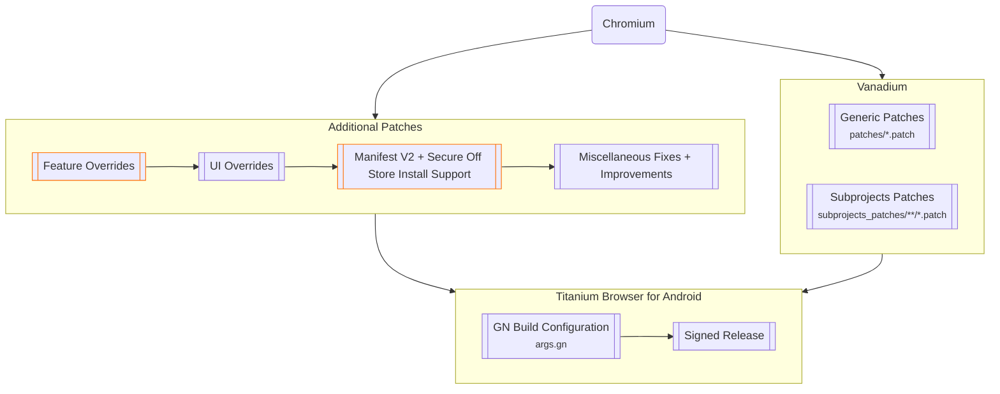

## 2026-10-10 — Titanium 155 strict rebase; signed APK build ready

Target `155.0.8059.39` remains pinned to Titanium `c433018f78b54dea5573f2789ed086022c7ec6f1`, Vanadium `c1892f4db7a828b9fcbca9ab6a6898b0a7396fae`, Chromium `3ff7ac5a9224be9156d7f8703a06e22890aafd34`.

Build #175 run38053980595 completed its diagnostic purpose: exact #174 completed cache restored at 2026-10-10T13:01:24Z; 7 feature conflicts reported; no compilation or new cache save. The output checkpoint was returned unchanged after preparation. Actual source audit artifact11669794988 ZIP SHA256 `7e90d238cbc3d398641efb908b188846e7f2ea8b2b797c9666d8ef4345e3c487` supplied the before-source bytes.

All 25 patches were rebased in order. Six conflict features required import/context or GN list adjustments only; the tab switcher constructor now uses M155 `TabListLayoutType.GROUPED` / `FLAT` in place of the removed `actionOnRelatedTabs` boolean, retaining grouped defaults and flat Kiwi modes. Manifest's 99 before/after hashes are now actual M155 measurements. Strict application, all 99 after hashes and a second idempotent application passed; series checksum/registration/file-list verification passed; 49 local tests: 48 passed and 1 real-Ninja test skipped locally (required in CI). No unresolved rejects remain.

The main workflow is restored to actual signed APK production: 350-minute jobs, 270-minute maximum Ninja budget with 45-minute finalization reserve, exact-cache continuations and require-apk. First restore remains literal `kiwi-incremental-154126-d37b865151e144bd2117984a84109ecdd8ba8c09-37564503375-1-continue-2`; first transition identity is `26092e68277c970eaa94164e9d62438b1fe975ea:5f832b54eab6d367d09166c49f57b7f6dfa7a5ae:8eaafabb47f12210d524f648b78bce074fa3c83e:validation`; later transition identities are empty. Never delete or clean output, overwrite a cache or fall back. An exact restore miss stops. No M153 dependency-pruning workaround is enabled.

Preserve all existing features, saved settings and Photopea JIT exception; removed 220/225 stay removed. Continue monitoring through final APK/hash/v2-signature/source tests/completed-cache verification. This preparation is not an APK completion claim, and device behavior remains unmeasured.

## 2026-10-07 — 154.0.8037.126 signed APK completed

Build [#174](https://github.com/nojirokaimo-svg/android-browser-dev-tk/actions/runs/37564503375), commit `d37b865151e144bd2117984a84109ecdd8ba8c09`, completed successfully at 2026-10-07T14:02:09Z. The initial build and continue-1 preserved exact incremental checkpoints; continue-2 produced and signed the APK. No cold/clean build or output/cache deletion was performed.

- [APK artifact](https://github.com/nojirokaimo-svg/android-browser-dev-tk/actions/runs/37564503375/artifacts/11487127820): `Titanium-Kiwi-core-154.0.8037.126-arm64-v8a.apk`, 326,445,738 bytes.
- APK SHA-256: `ee174ad5f0db4a6a59641b50ded11cc9e3b9276a652298ca3ddeca00e535d076`.
- Artifact ZIP SHA-256: `540c53192d2fbd59a8360456e46d50f5181a6e913feb006ee5488f40a3120156` (143,722,096 bytes); downloaded bytes match the Actions digest.
- Android v2 signature: verified by CI apksigner and independently from the downloaded APK (RSA signature, certificate/public-key match, and full APK protected-content digest). Certificate SHA-256: `32a2fc74d731105859e5a85df16d95f102d85b22099b8064c5d8915c61dad1e0`.
- Final source audit artifact `11484109132`, ZIP SHA-256 `e2e111e7072016200993e45683747eb50c2843fdef3ad431503284c021eb4d11`: all 99 before/after hashes match the manifest and actual tar contents. Strict ordered 25-patch reapplication from the actual runner baseline succeeds; all final hashes match; second application is idempotent.
- All 25 patch checksums, registrations and file lists verify. CI's 39 relevant tests pass, including the real Ninja fixture. Local discovery: 45 tests, 44 passed and the real Ninja test skipped because Ninja is unavailable locally. Conflict diagnostics and independent clean-hunk application tests pass.
- Completed immutable cache saved at **2026-10-07T14:01:46.2023505Z**, job `112800237132`: `kiwi-incremental-154126-d37b865151e144bd2117984a84109ecdd8ba8c09-37564503375-1-continue-2`. Main and update-upstream workflows now restore this literal completed key by default. Initial transition identity is empty; update-upstream defaults to `v154.0.8037.126`. Exact misses still stop immediately.

Pins: Titanium `26092e68277c970eaa94164e9d62438b1fe975ea`, Vanadium `5f832b54eab6d367d09166c49f57b7f6dfa7a5ae`, Chromium `8eaafabb47f12210d524f648b78bce074fa3c83e`. Existing 25 features and saved settings, including the user's Photopea JavaScript JIT exception, are retained. Removed 220 power-saving and 225 Hameln injection remain removed. **This APK has not been tested on a physical device.** Historical checkpoints below are superseded by this completed .126 result. The completion record and cache-default changes use `[skip ci]`; no extra APK build is requested.

## 2026-10-02 — Titanium 154 final APK (Build #172)

Build #172 (commit `1a40491d584ff313f1fa36aa34f9131f9877c65d`, run `36835438451`) completed the Titanium `154.0.8037.92` arm64 APK from exact incremental checkpoints without a clean or cold build.

- Run: https://github.com/nojirokaimo-svg/android-browser-dev-tk/actions/runs/36835438451
- APK artifact: https://github.com/nojirokaimo-svg/android-browser-dev-tk/actions/runs/36835438451/artifacts/11194275751
- Artifact ZIP SHA-256: `f128448ffd20872b8a960bd5a45b63821191b0c047112ed710f2732e828ff529`
- APK SHA-256: `a23d6ebcd533862985e45ff6d13b1ae0b6d54684024daf7b1fb62384c1627932`
- Android APK Signature Scheme v2: verified `true`
- Completed exact cache: `kiwi-incremental-154-1a40491d584ff313f1fa36aa34f9131f9877c65d-continue-2`
- Source audit: all 99 before/after hashes match the manifest; all 25 ordered feature patch checksums and file lists match.
- Verification: 39 CI tests passed; the fresh local suite ran 45 tests with 44 passed and only the real-Ninja fixture skipped because Ninja is unavailable locally. Strict apply/idempotence and conflict/best-effort diagnostics are covered and passed.
- Removed features remain removed: ultra power-saving patch 220 and Hameln-specific injection patch 225 are not in the 25-patch series.

The APK was not tested on a physical device, so runtime/UI behavior is not claimed as device-verified.

## 2026-10-01 — Build #164 preparation failure and exact-source correction

Build #164 (`c2d3d8e0d1402848d7d541f44f0602199fe8dc30`, run `36801569093`) restored the exact completed #163 cache successfully, then stopped before compilation because two pre-apply manifest hashes differed from the actual runner source. The actual `SharedPrefsUtils.java` uses final default fields and constructor delegation; `theme_preferences.xml` has no final newline. The previous local subset reconstruction did not match these bytes.

The source audit artifact `11135983527` (ZIP SHA-256 `4c4cf1bc9b6b7f573d1c00d6c6be311abbcbd7e419bbd2526269cca776468847`) contains the actual 99-file post-Titanium baseline. The preference registry, Night mode and tab-switcher patches are re-serialized against that baseline, preserving upstream constructor changes. Both before hashes and the resulting preference-helper after hash are measured from the actual sources. Strict pre-apply verification remains enabled. All 25 patches and final 99 hashes are verified against the downloaded runner baseline, including repeat application.

No Ninja compilation ran in #164 and no partial cache was saved. The unchanged exact #163 cache remains the initial restore key for the corrected build; no cache cleanup, overwrite or cold fallback is allowed.

# Titanium Browser for Android

## 2026-10-01: Titanium 154 update

| Upstream | Pinned revision |
|---|---|
| Titanium v154.0.8037.92 | `dd8d8a969fb6af762a3c2445ff455f7e48626993` |
| Vanadium | `826316da0994ebd78601a86ba5c0cb34b46ba32d` |
| Chromium 154.0.8037.92 | `334b65d254ccc35df4fca82706d1753227b01039` |

The unused extra power-saving feature (220) is removed: no menu toggle,
settings switches, renderer limit, reduced-motion override, or Prerender2
suppression is installed by the Kiwi series. Existing saved values are inert.
The independent dark page/card/menu colors, default-hidden tab search,
copied-link row, extensions and backups remain in the 25-feature series.
The Hameln-specific injection remains withdrawn.

All 25 patches were rebased in order against the M154 post-Titanium subset.
The manifest now measures every patch-owned file: 99 before/after hashes,
including ChromeTabbedActivity.java. Strict application must match these
hashes again in the actual runner preparation; unknown drift stops before
compiling. Best-effort mode still identifies feature/file conflicts and applies
independent clean hunks. Full before/after source archives and hashes are uploaded.
Local verification: 38 Python tests, complete patch integrity, strict ordered
reapplication, all 99 final hashes, and idempotence passed. APK compilation
and device behavior remain pending.

The first job restores only Build #163's completed immutable checkpoint:
`kiwi-incremental-153-780689451ec17d83ff74d72a733205b5644fa279-stage-11`.
Its save was confirmed in job 108056714484 on 2026-09-25 at 12:15:56 UTC.
The source transition accepts only the exact prior M153 identity, preserves
Ninja history/objects/generated outputs, and regenerates GN for M154 using
Ninja (`use_siso=false`). Cache miss stops immediately. No deletion, clean,
cache overwrite, or older/empty fallback is permitted.

GitHub-hosted jobs have a six-hour limit. Jobs use 350 minutes with a
maximum 270-minute compile budget; elapsed preparation reduces that budget
when necessary to reserve 45 minutes for shutdown, signing, cache save and
artifact upload. Continuation jobs run only when the APK is unfinished and
the preceding job succeeded in saving its exact checkpoint. Compiler failures
require diagnosis before a new resume, not blind retries or restarting from #163.
Final completion requires Android v2 signing, APK/artifact SHA-256, runner
source verification and updated handoff records. Device claims require device evidence.

The sections below describe historical builds; their cache keys are not fallback candidates.

## Historical Hameln rollback

The Hameln-only page background injection was withdrawn after a device report
that opening syosetu.org crashed the browser in Build #162. The last verified
APK without this feature is Build #161; the exact cause of the crash is not yet
known. No website-specific script is installed by the current patch series.

## Historical separate colors and power saving (Build #160)

The source patches expose three independent dark interface colors under
Settings > Appearance: page background, raised cards/search fields, and
menus/popups. Each has standard colors and a custom dark `#RRGGBB` entry.
When unset, the original layered palette remains. Existing custom
`dark_surface_hex` values continue to control the page background; the new
raised and popup colors default to their original shades.

The overflow menu gains an extra power saving toggle directly below Night
mode. Settings > Tabs and tab groups offers separate switches for requesting
reduced web motion, limiting renderer concurrency to two, and disabling
Prerender2. These settings take effect after restarting the browser. They do
not guarantee a particular CPU or battery reduction while an active page is
running scripts, video, or extensions. GPU acceleration, security updates,
extensions, and backups are left enabled.

Build #160 completed on 2026-09-25 from Build #157's exact cache and supplied
all three previously unknown post-Titanium Android file hashes. Final
[Build #161](https://github.com/nojirokaimo-svg/android-browser-dev-tk/actions/runs/36093793201)
restored #160's immutable completed `out/Default` key
`kiwi-incremental-153-e5b7f2f3c17d4066478dd07a23fe4a0a3c32bac9-stage-11`,
verified all 14 archived source files against the now-complete manifest, passed
27 relevant tests, applied 26 patches, and signed the arm64 APK with Android v2.
APK SHA-256: `10ac551e86e57381a2fc15f10d6b5c89337855d6ff6aca99e4bdc6c78003965a`.
Download artifact ZIP SHA-256: `3c46fd9a0747edfaf9a78adf91ae66a9f25e6cb156e016ab28b42a9590f69783`.
Battery savings and the appearance of every theme surface remain unmeasured on a device.

## Tab-search setting and browser dark surfaces (Build #157)

Build #157 added **Search tabs** under Settings > Tabs and tab groups.
It defaults to off, hiding the search field in the tab switcher; enabling the
setting restores the search field. Settings > Appearance also offers an optional
dark surface color: default palette, black, two dark gray presets, and a custom
`#RRGGBB` value. A custom color is applied to browser-owned settings surfaces,
history, menus and submenus, dialogs and sheets in dark mode. The default
palette and light mode retain their current behavior. These changes require a
signed APK and device inspection before their visual coverage can be claimed.

Build #157 succeeded on 2026-09-24, signed the APK with Android v2 and saved
`kiwi-incremental-153-7c2a317e5db05e1b647eeba4e5010081906f0615-stage-11`.
The extra power controls and separate colors above are not part of that APK.

Build #156 (2026-09-24, commit `fe51b864d2987e96a7a691f68ad6b4df94420330`,
run `35990362979`) succeeded and saved the exact completed incremental cache
`kiwi-incremental-153-fe51b864d2987e96a7a691f68ad6b4df94420330-stage-11`.
The next build must restore that literal key, fail on cache miss, and preserve
Ninja's logs, dependencies, objects and generated outputs. The user confirmed
on a device that #156 **displays** the copied-link row. Tapping the row to
navigate/search has not yet been explicitly confirmed.

## New-tab clipboard candidate

Build #153 compiled and signed an APK, but the user confirmed on 2026-09-24
that its copied-link row never appeared on the device. The C++ candidate
was gated by Android clipboard format reporting and native suggestion delivery.
The new feature patch adds a Java UI fallback at omnibox focus: for an empty
new tab with a primary clipboard item, display one localized "Copied link"
row immediately. When native results arrive without a clipboard suggestion,
the Java row stays visible; native clipboard matches remain preferred.
History is hidden only in that empty new-tab context. Tapping the Java row
reads the **current** clipboard text and invokes Chromium's URL/search
classifier. Copied links therefore open in the current tab and copied text
searches; ordinary typed suggestions still work. The fallback does not read
clipboard text before the user's tap.

Three Android mediator unit tests cover focus/empty native results, updated
clipboard URL navigation, copied-text search, and hiding new-tab history.
The repository's patch checks and Python unit tests do not execute these Android
unit tests. The row's appearance was confirmed by the user after #156; navigation
on tap remains to be verified on the device.

## Titanium-Kiwi incremental upstream updates

The `codex/kiwi-ui-port` workflow applies the feature-scoped patches in
`kiwi_port/patches/series.json` to pinned Titanium, Vanadium, and Chromium
commits. The current target is Titanium `v154.0.8037.126`.

Upstream transitions restore an exact immutable completed `out/Default`
checkpoint, prepare the new pinned source tree, regenerate GN metadata, and let
Ninja rebuild dirty edges across staged jobs. The workflow never runs a clean
build, deletes `out/Default`, overwrites an existing cache key, or falls back to
an older or empty cache. Build #150 restored the exact completed Build #149
checkpoint, applied all 22 feature patches, and completed the incremental APK
build. Its immutable checkpoint is
`kiwi-incremental-153-9099484be06bb034d1efd4d120e9bd8aa1262dd0-stage-11`.
Build #151 subsequently saved immutable checkpoint
`kiwi-incremental-153-addbe54fe875cd72e8c0c1543930ea0549fef857-stage-11`.
Build #152 saved checkpoint
`kiwi-incremental-153-92becf4647069d88aa8e59491282422c3ec70d62-stage-11`.
Build #153 saved the newer completed checkpoint
`kiwi-incremental-153-6891fb00adc2c3adfacf23e893c8827d8f89502d-stage-11`.
Build #154 restored that key but failed while compiling the new Java fallback:
the persisted upstream-transition source epoch predated the compiled objects,
so the edited `AutocompleteMatch.java` and resource XML were treated as old.
The missing method reflected stale compiled dependencies. The job saved its
16 GB partial `out/Default` at
`kiwi-153-295f56e0c1b01000326e3f86a7fde470b767b965-stage-11`.
Build #155 restored that key, recovered the source timestamps, and rebuilt the
missing `AutocompleteMatch` method. Its only remaining Java error was
`org.chromium.chrome.R.string.kiwi_clipboard_link` in the omnibox library. The
new label now lives in `//chrome/browser/ui/android/omnibox:java_resources`,
registered in that module's `BUILD.gn` and referenced through its local `R`.
#155 saved the 16 GB partial checkpoint
`kiwi-153-366b77e8e43375fb846dfcaf5e22b9de5cf853e2-stage-11`.
Build #156 completed and superseded this partial checkpoint. The next build
restores the #156 completed key above, keeping `.ninja_log`,
`.ninja_deps`, object files, and generated outputs. A cache miss stops before
source preparation. The upstream-update workflow separately requires
`incremental_cache_key` and matching `transition_from_identity`.

Build #150 produced a 324,184,408-byte APK, verified with Android APK Signature
Scheme v2. APK SHA-256:
`3d62524b3f69a666507704aa3e2ba3eb47a95522e1cd375fffaa4520c31965b9`.
The artifact ZIP SHA-256 is
`1ade241813369addd8cf4cc0abccb339851ecc7d2f0c43c15de56c5049fe7219`.
Build #150 compiled the earlier candidate, but the user confirmed it did not
appear on the device. Build #153 also failed the device-visible requirement;
#154 and #155 did not produce an APK. The #156 Java fallback displayed the row
on the user's device; its navigation on selection has not been confirmed.

On Android, returning after a long pause retains the selected tab instead of
creating/selecting an NTP. The NTP itself can still be opened intentionally.
Focusing its empty toolbar URL field with an available clipboard item is intended to show one copied-link row; typing restores normal search/history suggestions. Selecting the
clipboard row uses Chromium's existing URL navigation or text search handling.

If a transition fails, keep the last completed cache intact, fix the named
feature patch or build configuration, and push a new commit. Regenerate patch
checksums in `series.json`, update matching before/after hashes in
`manifest.json`, then run `python3 kiwi_port/verify_series.py` and the Kiwi port
unit tests before restarting the staged build. Best-effort reapplication names
the conflicting feature and target files while applying independent features.

[](https://github.com/jqssun/android-titanium-browser)
[](https://github.com/jqssun/android-titanium-browser/releases)
[](https://github.com/jqssun/android-titanium-browser/blob/main/LICENSE)
[](https://github.com/jqssun/android-titanium-browser/actions/workflows/build.yml)
[](https://github.com/jqssun/android-titanium-browser/releases)

A secure and fully open-source, Chromium-based web browser with support for extensions, based on [Vanadium](https://github.com/GrapheneOS/Vanadium) by [GrapheneOS](https://github.com/GrapheneOS). This project was formerly known as [Helium Browser for Android](https://github.com/jqssun/android-helium-browser) but was later renamed to avoid branding confusion. To maintain a fast and native experience for everyone, advanced features are modularized into [**Titanium Extension for Android**](https://github.com/jqssun/android-titanium-extension).

For the latest builds, see [**Releases**](https://github.com/jqssun/android-titanium-browser/releases/latest). You can also update between GitHub and Google Play releases seamlessly.

[](https://play.google.com/store/apps/details?id=io.github.jqssun.helium)
[](https://github.com/jqssun/android-titanium-browser/releases/latest)


## Usage

### Installing Extensions

For Chrome extensions, navigate to [Chrome Web Store](https://chromewebstore.google.com/), enable **Desktop site** using the menu button <kbd>⋮</kbd> in the top right corner, and proceed as normal.

For [Opera Add-ons](https://addons.opera.com/), [Microsoft Edge Add-ons](https://microsoftedge.microsoft.com/addons/), or other marketplaces, targeted User Agent modifications may be required. See [**Titanium Extension for Android**](https://github.com/jqssun/android-titanium-extension) for instructions.

You can also load an unpacked extension manually by navigating to the **Manage extensions** page or [`chrome://extensions`](chrome://extensions). Enable **Developer mode**, select **Load unpacked**, and choose the folder containing the extension in the Storage Access Framework (SAF) picker. Manifest V2 (MV2) extensions are supported. It may take a moment for the extension to load.

### Using Extensions

To run an extension in Incognito (OTR) mode, go to **Manage extensions**, find the extension you want to use in Incognito mode, select **Details**, and turn on **Allow in Incognito**.

For advanced features including external download manager support, enhanced dark mode, and additional privacy options, you can use [**Titanium Extension for Android**](https://github.com/jqssun/android-titanium-extension).

### Debug URLs

To view and access the debug URLs, use [`chrome://chrome-urls`](chrome://chrome-urls). For **Experiments**, use [`chrome://flags`](chrome://flags).

### WebRTC IP Policy

The option is available by using the menu button <kbd>⋮</kbd> in the top right corner, then selecting **Settings**, **Privacy and security**. If you experience issues with WebRTC due to IPs being shielded by default (e.g. [Discord Voice](https://discord.com/blog/how-discord-handles-two-and-half-million-concurrent-voice-users-using-webrtc)), try changing it to **Default public interface only**, or **Default**.

## Implementation

> [!WARNING]
> [Titanium Browser for Android](#titanium-browser-for-android) only attempts to improve security and privacy where possible. For better protection on Android, you should instead use [GrapheneOS](https://grapheneos.org) with [Vanadium](https://vanadium.app), which additionally integrates patches into Android System WebView and provides significant kernel and memory management hardening on the OS level.



## Building

All releases are built using [Actions](https://github.com/jqssun/android-titanium-browser/actions). Current releases can also be attested using [GitHub CLI](https://github.com/cli/cli).

```shell
gh attestation verify *.apk -R jqssun/android-titanium-browser
```

This repository provides the build script to compile on the latest Ubuntu, and may also work with other Linux distributions.

To build these releases yourself via CI (e.g. GitHub Actions), fork this repository. Supply your `base64` encoded `keystore.jks` and `local.properties` (containing `keyAlias`, `keyPassword` and `storePassword`) to [**Repository secrets**](https://github.com/jqssun/android-titanium-browser/blob/main/.github/workflows/build.yml#L49-L50) under **Settings** > **Secrets and variables** > **Actions**. To generate a release, go to **Actions**, select **Build**, and select **Run workflow**. Under **Runner**, you can either use a GitHub-hosted runner by entering `ubuntu-latest`, or `self-hosted` for your own hardware.

## Credits

This project would not have been possible without the huge community contributions from [Vanadium](https://github.com/GrapheneOS/Vanadium), and without the privacy-focused, open-source approach shared by various other Chromium projects. All credit goes to the original authors and contributors. This project started around the same time as [Helium Browser for Linux](https://github.com/imputnet/helium-linux) but it is not affiliated with the desktop Helium project.
